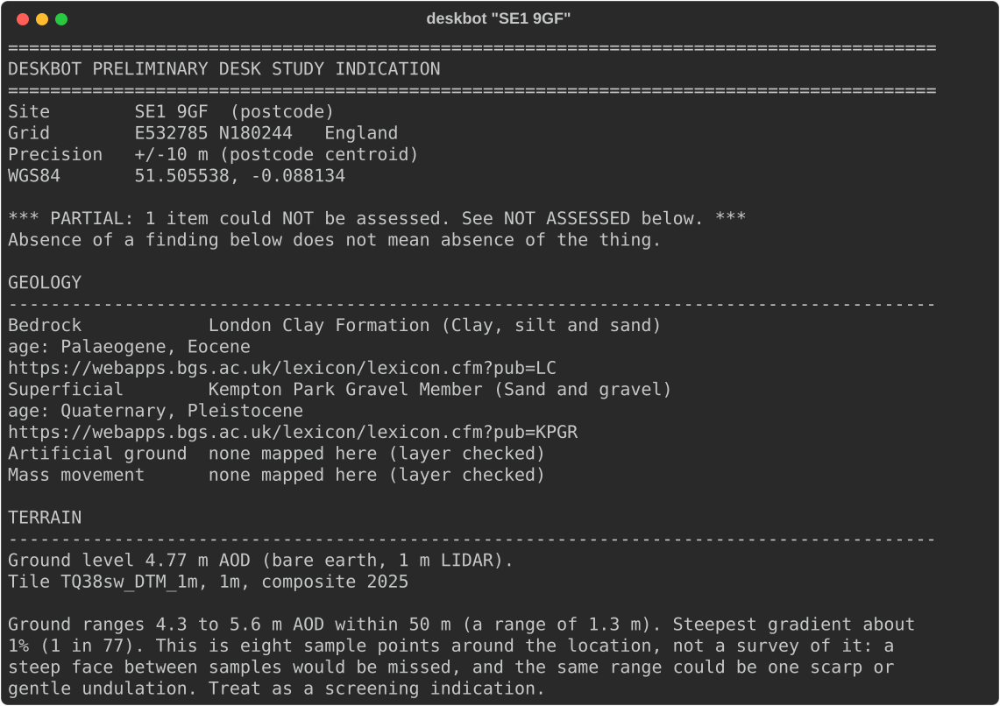
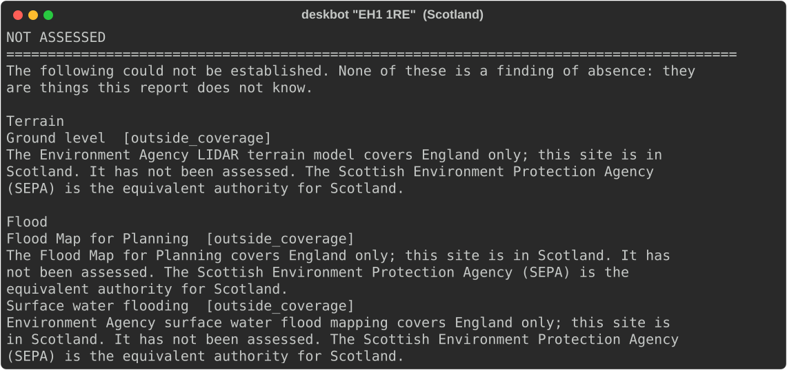
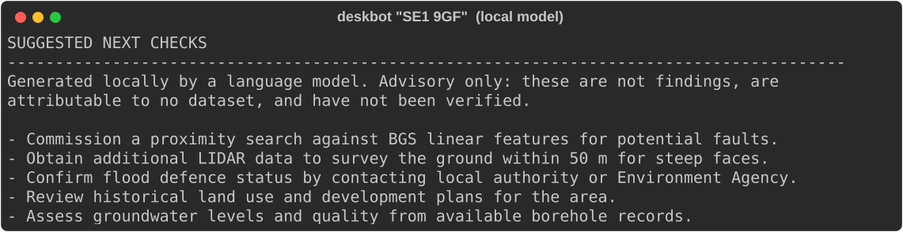
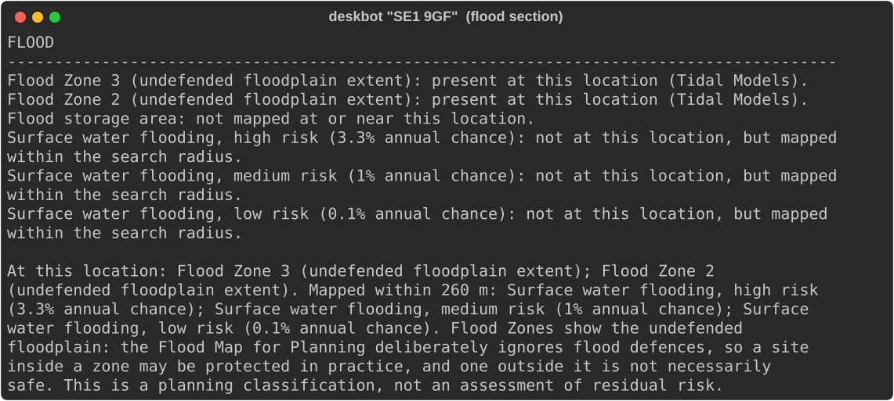
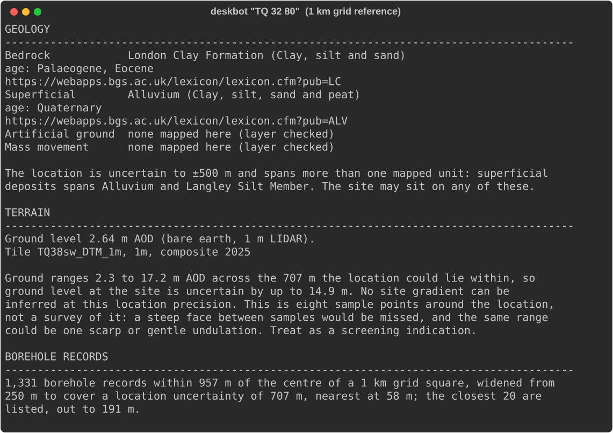

# Deskbot

A CLI that takes a UK postcode or OS grid reference and drafts a **preliminary
desk study indication** from public data.

Not a Phase 1 desk study. Not a site investigation. Not advice. An indication,
with every claim attributed to its source and every gap declared as a gap.

```
deskbot "SE1 9GF"
deskbot "TQ 32785 80244" --radius 500
deskbot "SE1 9GF" --json | jq .flood
deskbot "SE1 9GF" --no-llm
```



---

## The one idea

**A report that cannot tell you what it does not know is worse than no report.**

Every source Deskbot uses can answer a question with nothing, and "nothing" means
different things:

- the source was checked and there is genuinely nothing there
- the source does not cover this location at all
- the source failed
- we never asked

On the wire these are frequently identical. Ask the Environment Agency whether a
site in Edinburgh is in Flood Zone 3 and it answers `{"count": 0}` — exactly what
it answers for a field in Surrey that is genuinely not in a flood zone. Render
that naively and a Scottish site reads **"no flood risk identified"** for a
question nobody asked.

So results are a discriminated union, and the conflation is unrepresentable
rather than merely discouraged:

```python
Assessed[T]      status="assessed"      findings: list[T]   # may be empty
NotAssessed      status="not_assessed"  reason, detail      # no findings field
```

`NotAssessed` has no `findings` attribute. Code that reaches for it fails, rather
than quietly rendering an empty section that reads as reassurance. Gaps are
collected, declared in the report header before any finding, and rendered in
their own block. A section with nothing to say is not rendered at all — an empty
section is exactly what looks like a clean bill of health.



That is a site in Edinburgh, showing the two England-only gaps. Geology and
boreholes report normally above it, because BGS covers Great Britain. Flood and
terrain become gaps that name the country and point at SEPA. There is no flood
section — not an empty one, none. The same block also carries a standing faults
gap, trimmed from this capture and explained below.

---

## The model is a router and an advisor, never a source of truth

This is the second project to land on the same position, and it is worth stating
once rather than leaving implicit in two sets of decisions.

In **Ask the Hole**, the local model chose which question to ask and never
computed an answer. In **Deskbot** it cannot even state a fact. Every finding,
figure, caveat and gap in a report is rendered deterministically from Pydantic
models. The model's entire job is to suggest what a Phase 1 should look at next.

That is not squeamishness, it is where the evidence pointed. Given the findings
plainly and asked to summarise, qwen2.5:7b:

- **relocated a finding.** "Surface water flooding mapped *within 260 m*" became
  "There is a high probability of surface water flooding at 3.3%" *at the site*,
  and the conclusion then built on it.
- **invented a mechanism.** "London Clay Formation and Kempton Park Gravel Member
  could exacerbate flood impacts due to their permeability characteristics" is
  unsupported, and London Clay is not permeable.

Both from a prompt that stated the facts clearly, which is why instruction alone
is not the control.

Confined to advice, a fabrication is a bad suggestion rather than a false fact.
Output is still checked before release, on two axes:

| Control | Catches |
|---|---|
| **Grounding** | any number not present in the findings it was given |
| **Absence denylist** | "no risk", "not at risk", "no evidence of", and similar |

The denylist allows a phrase that appears in the findings — dataset labels
legitimately read "high risk (3.3% annual chance)" — and forbids the same phrase
when the model originated it.

Measured over 18 runs (`scripts/measure_advisor.py`):

```
passed                13  (72%)
ungrounded_number      5  (28%)
absence claims:        0  of 18
```

Worth reading carefully. **The denylist caught nothing**, because confining the
model to advice already removes the behaviour the denylist exists to stop — the
absence claims came from the *summarising* prompt. Containment is what earns its
keep, rejecting an invented figure in roughly one run in three. The two controls
catch different things, and the role restriction is doing more work than either.



Note what it suggests: commissioning the fault search the report declined to do,
and confirming the flood defence status the caveat flags. It reads the gaps as
work to be done, which is the whole of its job.

---

## What leaves the machine

Worth being precise, because "local model" and "no network" are different claims
and only the first is true.

**The reasoning is entirely local.** qwen2.5:7b runs on your machine via Ollama
on loopback. There is no AI SDK in the dependency list, no API key anywhere in
the source, and the only model endpoint in the codebase is `127.0.0.1:11434`.
There is also no fallback: point Deskbot at a dead port and the suggestions
section becomes a gap saying the model could not be reached. If something remote
were quietly filling in, that section would still be populated.

**The data lookups are not local, and are not meant to be.** Deskbot queries five
hosts:

| Host | Purpose |
|---|---|
| `api.postcodes.io` | postcode to coordinates |
| `services1.arcgis.com` | ONS country boundaries, EA flood |
| `map.bgs.ac.uk` | BGS geology and boreholes |
| `utility.arcgis.com` | EA LIDAR terrain |
| `127.0.0.1:11434` | the local model |

The first four are public map services, not model providers. What reaches them is
the **coordinate being looked up** — nothing else about the site, and nothing
about you. If a site location is itself sensitive, that is the exposure to weigh,
and `--no-llm` does not change it: the data lookups reach outward, the model does
not.

`--no-llm` produces a complete report with every finding intact, because nothing
factual depends on the model. The reverse does not hold — without a network there
is no report, because the data is all remote.

---

## What it reports

| Tool | Source | Coverage |
|---|---|---|
| **locate** | postcodes.io + ONS country boundaries | UK |
| **geology** | BGS Geology 1:50k | Great Britain |
| **boreholes** | BGS SOBI borehole index | Great Britain |
| **flood** | EA Flood Map for Planning + Surface Water | **England only** |
| **terrain** | EA LIDAR Composite 1 m DTM | **England only** |

All open, all keyless, all queried in EPSG:27700. Anything requiring an API key
or a paid licence was dropped rather than worked around; see
[docs/data-sources.md](docs/data-sources.md).

A Scottish or Welsh site produces a **partial report**: geology and boreholes are
Great Britain wide and still report, while flood and terrain become explicit
gaps pointing at SEPA or NRW. It does not refuse, and it does not pretend.

### Things the report will not let you misread

- **Flood Zones ignore flood defences.** Findings are labelled
  `Flood Zone 3 (undefended floodplain extent)` so the qualification survives
  being quoted out of context. Southwark is Flood Zone 3 and sits behind the
  Thames Barrier.

  

- **Faults are never assessed.** BGS maps them as lines and a point query cannot
  reliably intersect one. Rather than report "no faults" everywhere, the report
  says it did not look.
- **Precision is a behaviour, not a caveat.** A 1 km grid reference is uncertain
  by 707 m, so a 250 m borehole search widens to 957 m and *restates its own
  claim* accordingly. Where widening would exceed 1 km the search is refused as
  `insufficient_location_precision` rather than answered misleadingly.

  

- **Counts are not proximity.** "1,331 records" means little; "nearest at 58 m"
  is the number that decides anything, so both are reported.
- **Sampling is not surveying.** Terrain relief comes from eight sample points; a
  scarp between them would be missed, and the report says so every time.

---

## Development

```bash
uv sync --extra dev
uv run pytest                    # 212 tests
uv run pytest -m "not network"   # offline subset, no outbound calls
uv run ruff check . && uv run ruff format --check .
python scripts/probe_sources.py  # are the sources still reachable?
uv run python scripts/capture_screenshots.py   # regenerate the README images
uv run python scripts/measure_advisor.py       # how often is the model overruled?
```

Every image in this README is produced by running the tool against the live
sources, never mocked up, so a capture cannot drift away from actual behaviour.

Network-marked tests hit the real public endpoints. The values they assert are
published map data rather than live readings, so they are stable.

`scripts/probe_sources.py` is stdlib-only and dependency-free, so it can verify
the sources from a bare interpreter when something looks wrong.

---

## Licence and attribution

**The code is MIT** — see [LICENSE](LICENSE).

**The data is not ours and carries its own terms.** MIT covers this tool, not the
datasets it queries. Those are variously Open Government Licence v3 (postcodes.io,
ONS, Environment Agency) and BGS OGL-with-acknowledgement, and each obliges you to
reproduce its attribution. Deskbot does that automatically: every report ends with
an attribution block naming each source consulted and reproducing its required
wording verbatim.

Per-source licensing, including what was deliberately **not** used, is recorded in
[docs/data-sources.md](docs/data-sources.md). Nothing requiring an API key or a
paid licence was worked around: BGS DiGMapGB-50 bulk data and the OS Names API
were both dropped on those grounds rather than circumvented.
